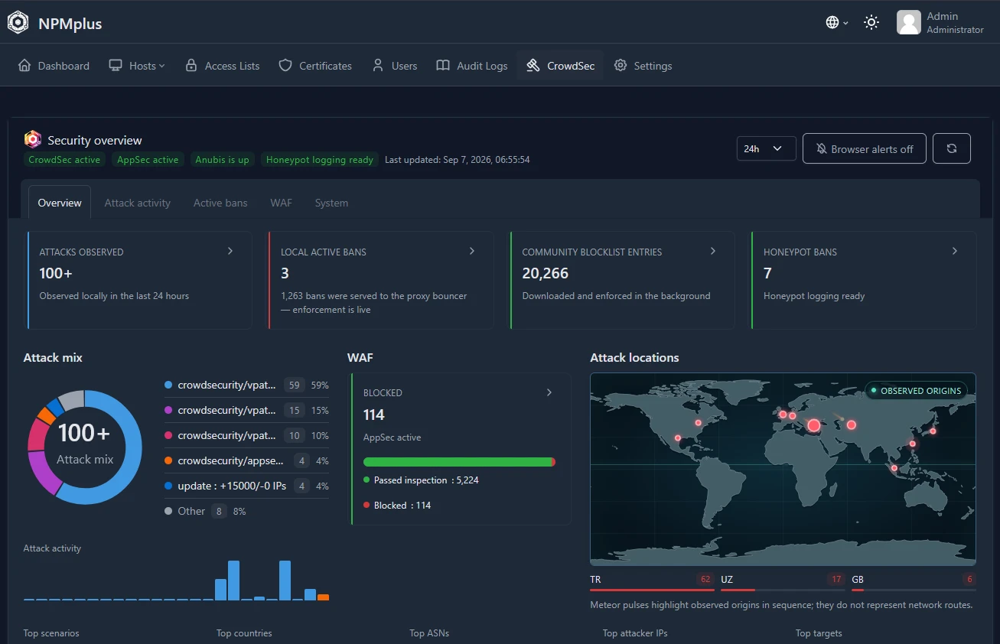

# NPMplus Security Fork — maintained by mangyan1

NPMplus gives you a web dashboard for publishing services securely through Nginx. This security-focused fork is maintained by [mangyan1](https://github.com/mangyan1) and adds a guided server installer, CrowdSec protection, automatic backups, safe updates with rollback, and additional security fixes.

It is based on [ZoeyVid/NPMplus](https://github.com/ZoeyVid/NPMplus) and the original [Nginx Proxy Manager](https://github.com/NginxProxyManager/nginx-proxy-manager). [Project website](https://mangyan1.github.io/NPMplus/)



## Contents

| Task | Section |
| --- | --- |
| Install on a new server | [New installation](#new-installation) |
| Open the dashboard | [Open the dashboard](#open-the-dashboard) |
| Update, repair, restore, uninstall | [Maintenance menu](#maintenance-menu) |
| Move to a new machine | [Migrate to a new server](#migrate-to-a-new-server) |
| Check it is running | [Status and logs](#status-and-logs) |
| Something broke | [Troubleshooting](#troubleshooting) |
| Feature overview | [Main features](#main-features) |
| Maintain the fork and merge ZoeyVid updates | [Fork maintenance guide](FORK.md) |
| Everything else (updates, boot, backups internals, diagnostics) | [Setup and operations guide](docs/setup-npmplus.md) · [Advanced reference](ADVANCED.md) |

The recommended installer is the pinned **v2.15.1-mangyan1.rc.5** release candidate, which is SHA-256-verified and resolves its images to immutable digests. The maintained `develop` channel contains the newest fixes between releases and remains available for rolling test deployments on the [Releases page](https://github.com/mangyan1/NPMplus/releases).

## Before you start

You need:

- A Debian 12/13 or Ubuntu 22.04+ server.
- A user account that can run `sudo`.
- An AMD64-v2 or ARM64 server.
- Ports `80/tcp`, `443/tcp`, and `443/udp` available for your websites.
- A domain pointed to your server when you are ready to publish a website.

The installer can install Docker if it is missing. It asks before making important changes.

## New installation

For the recommended maintained build, copy this entire command, paste it into a **test server** terminal, and press Enter:

```bash
wget -qO setup-npmplus.sh https://github.com/mangyan1/NPMplus/releases/download/v2.15.1-mangyan1.rc.5/setup-npmplus.sh &&
wget -qO setup-npmplus.sh.sha256 https://github.com/mangyan1/NPMplus/releases/download/v2.15.1-mangyan1.rc.5/setup-npmplus.sh.sha256 &&
sha256sum -c setup-npmplus.sh.sha256 &&
sudo bash setup-npmplus.sh
```

This downloads the version-pinned RC5 installer and verifies it against its SHA-256 file before running it. Review the script before running it on a production host. Rolling `develop` builds remain available for maintainers directly from the [branch](https://raw.githubusercontent.com/mangyan1/NPMplus/develop/setup-npmplus.sh).

Select **Install NPMplus**, then answer the questions shown by the installer. If you are unsure, press Enter to accept the displayed default. The recommended defaults enable CrowdSec, CrowdSec AppSec web-application protection, the firewall bouncer, and Anubis. Anubis's global catch-all challenge defaults off so APIs, licensing servers, webhooks, monitors, and other non-browser clients continue to work. AppSec can still be turned off for an individual proxy host if an application has a confirmed compatibility problem.

For the easiest first login, provide an administrator email and password when the installer asks. The password is handled as a temporary secret and is not saved in `compose.yaml`.

## Open the dashboard

The dashboard uses HTTPS on port 81. New installations publish this port only on the server's loopback interface (`127.0.0.1:81`), so it is not reachable directly from the internet.

On the server itself, the dashboard is at:

<https://localhost:81>

From your own computer, open a terminal and run:

```bash
ssh -L 8181:127.0.0.1:81 YOUR_USER@YOUR_SERVER_IP
```

`127.0.0.1` is where port 81 listens on the server (do not use `localhost` here: the published port is IPv4-only, so a name that resolves to IPv6 fails). `8181` is the local port on your computer. Leave that terminal open and visit:

<https://localhost:8181>

Your browser may show a certificate warning because the local dashboard certificate is self-signed.

If you allow private-LAN dashboard access, the installer automatically detects and displays the VM's private address and permitted private subnet. Docker's port remains private on loopback; a small host listener makes it available at the private address through a subnet-limited UFW rule. You can then visit `https://VM_LAN_IP:81` from that LAN. Do not forward port 81 on your router.

If you did not provide an administrator email and password during installation, get the one-time setup token from the server:

```bash
sudo docker exec npmplus cat /data/npmplus/setup-token
```

Enter that token in the setup page. It is removed after the first administrator is created.

## Maintenance menu

After installation, one short command opens the maintenance menu for safe updates, CrowdSec checks, reboot diagnostics, restore, reconfiguration, and uninstalling:

```bash
sudo /opt/npmplus/setup-npmplus.sh
```

- **Safe update** - snapshot, new images, full health checks, automatic rollback on failure.
- **Check or repair CrowdSec** - tests containers, API, credentials, and registration; repairs rejected keys.
- **Startup/reboot diagnostic report** - read-only service, network, Docker, and container details to a private `/tmp` report.
- **Reconfigure installation** - reruns the advanced installation questions.
- **Create a backup now** - a fresh archive immediately (before a migration, or after changes), using the same helper as the daily cron.
- **Restore a backup from an archive** - put old data back onto this machine (see [Migrate to a new server](#migrate-to-a-new-server)).
- **Uninstall** - final backup, clear description, typed confirmation.

To move to a newer release later, use the installation command shown on that release's page. A `develop` installation should first switch to the current release candidate using the [pinned installer](https://github.com/mangyan1/NPMplus/releases) before its next maintenance.

Advanced opt-ins that an ordinary menu update deliberately preserves - enabling AppSec, protected startup, or the Cloudflare origin lock on an existing installation - each need one explicit command: see [Updating](docs/setup-npmplus.md#updating) in the operations guide.

## Migrate to a new server

Moving an installation to a new or more powerful machine is three steps: the daily backup archives already contain everything (database with all hosts, ports, IPs, access lists, certificates and settings, CrowdSec state, optional Anubis policy):

```bash
# 1. old machine: create a fresh backup, then copy it out with the scp
#    command the script prints (root-only folder, SSH only - archives
#    contain your TLS private keys)
sudo /opt/npmplus/setup-npmplus.sh --backup
sudo scp /var/backups/npmplus/<newest-archive> user@newmachine:/tmp/

# 2. new machine: install NPMplus first (sets up Docker, UFW, CrowdSec,
#    crons for THAT machine)
sudo bash setup-npmplus.sh        # menu: Install

# 3. new machine: put the old data on top - no need to type the archive
#    name, it lists every archive it finds (menu option 6, or:)
sudo /opt/npmplus/setup-npmplus.sh --restore
```

The backup action prints the exact `scp` command with the real filename, and a pull variant for copying from another LAN machine. `--restore` then finds the archive wherever it landed - `/var/backups/npmplus`, `/tmp`, or the current directory - and lists candidates newest-first; it also accepts an explicit file, a directory, or an unquoted glob, so a renamed archive works too. After the restore, log in with the **old machine's admin account**. Copying the whole `/var/backups/npmplus/` folder also works: drop it at the same path on the new machine and the restore picker lists every archive newest-first. Works between Debian and Ubuntu in either direction. Point DNS at the new machine before the next certificate renewal. Full details, safety behavior, and the manual equivalent: [Backups and restoration](docs/setup-npmplus.md#backups-and-restoration).

## Status and logs

```bash
sudo docker compose -f /opt/npmplus/compose.yaml ps
```

Every listed service should say `Up`. The `npmplus` service should become `healthy` after startup. The stack returns automatically after a server restart; with protected startup, a pre-Docker guard keeps public ports closed until CrowdSec enforcement and service health are proven. Details: [Updating](docs/setup-npmplus.md#updating) in the operations guide.

## What the installer handles

- One interactive menu for installation, updates, diagnostics, restore, and uninstalling.
- NPMplus and its web dashboard, with loopback-only dashboard access by default.
- Recommended CrowdSec, AppSec WAF, and firewall-bouncer protection, with per-host AppSec compatibility switches.
- Protected startup that fails closed before opening public listeners when CrowdSec enforcement is unavailable.
- Optional Cloudflare-only origin filtering, Anubis bot protection and honeypot bans, Caddy redirects, and a recommended UFW set: 443/tcp+udp public, SSH and the admin UI restricted to the private LAN, port 80 only by explicit choice.
- Safe monthly updates with automatic rollback, daily backups (seven kept), and CrowdSec credential healing.
- Hardened auxiliary containers: read-only root filesystems, dropped capabilities, `no-new-privileges`, health checks.

Backups are stored under `/var/backups/npmplus`; the update snapshot under `/var/backups/npmplus-last-good`.

## Troubleshooting

Show recent logs:

```bash
sudo docker compose -f /opt/npmplus/compose.yaml logs --tail=200
```

If an update refuses to start, it usually means a service is already stopped or unhealthy - the updater refuses to build a rollback snapshot from a broken stack. For recovery, backup restoration, CrowdSec diagnosis, or reboot reports, open the maintenance menu (option 2 or 3) and see the [setup and operations guide](docs/setup-npmplus.md#diagnostics).

When requesting help, share the command output but remove public IP addresses, domains, email addresses, and secrets first.

## Main features

- Proxy hosts, redirects, streams, access lists, certificates, and a modern admin dashboard.
- HTTP/3, modern TLS, mTLS, OIDC, `auth_request`, load balancing, and multiple access lists.
- Integrated CrowdSec and Anubis security dashboard: a compact overview with clickable KPI details, an attack-mix donut grouped by attack type with a per-interval activity strip, a WAF verdict card, attacker filters (IP/scenario/country/ASN/target), a lightweight animated attack map (no WebGL or map-tile downloads), bouncer enforcement status, paginated local alerts and bans, engine metrics, optional browser alerts, manual bans, exact-decision unban, and audit logging. Community blocklists stay enforced but are summarized as metrics instead of flooding the page with remote IP entries.
- Dedicated AppSec WAF monitoring shows whether protection is configured, inspected/passed/blocked request totals, block rate, and the active compatibility policy.
- Security headers, strict browser policy, protected session cookies, rate limits, and safer defaults.
- Daily container CVE monitoring, pull-request image gates, and a patched Caddy build from the stable release source.
- Support for Let's Encrypt and other ACME certificate authorities.
- Optional GoAccess statistics and API documentation in the dashboard.

See [Changes in this fork](ADVANCED.md#changes-in-this-fork-vs-zoeyvidnpmplus) for the detailed security and feature list.

## Releases and security reports

Release tags build AMD64 and ARM64 images in this repository, attach build provenance and an SBOM, and scan the exact images before publishing them to GitHub Container Registry. Publication also resolves and scans the exact Caddy, CrowdSec, and Anubis images selected by the installer. A release candidate updates only the `rc` channel; only a final release can update `latest`.

Each GitHub release includes a version-pinned `setup-npmplus.sh` and its SHA-256 checksum. The final image and installer files also receive GitHub identity-backed artifact attestations. After downloading an asset, advanced users can verify it with `gh attestation verify setup-npmplus.sh --repo mangyan1/NPMplus`; verify a release image with `gh attestation verify oci://ghcr.io/mangyan1/npmplus:<tag> --repo mangyan1/NPMplus`. Release candidates are for test systems first. Report suspected vulnerabilities privately by following [the security policy](SECURITY.md), not through a public issue.

## Existing NPMplus or Nginx Proxy Manager installation

Do not run the new-install command over an existing manual deployment. Read the [compatibility and migration notes](ADVANCED.md#compatibility-to-upstream) and make a backup first. Migrating back to the original project is not supported.

## Advanced configuration

Most users do not need manual Compose editing or custom Nginx configuration.

This fork is intentionally focused on reverse proxying and security. It does not automate PHP-FPM deployment: application stacks should own their PHP runtime, files, updates, and health checks. The legacy inbuilt and external PHP-FPM instructions remain advanced compatibility guidance only.

- [Host setup, updates, backups, recovery, and diagnostics](docs/setup-npmplus.md)
- [Advanced and manual configuration reference](ADVANCED.md)
- [Example Compose file](compose.yaml)

Guides written for other Nginx Proxy Manager versions may not match NPMplus. Ask before adding custom Nginx directives that duplicate built-in features.

## Get help

- [Questions and discussions](https://github.com/ZoeyVid/NPMplus/discussions)
- [Report a problem in this fork](https://github.com/mangyan1/NPMplus/issues)
- [NPMplus Discord](https://discord.gg/y8DhYhv427)

Please report fork-specific problems here before opening an upstream issue.

## License and attribution

This fork is distributed under the GNU Affero General Public License version 3 or later. It is based on the MIT-licensed Nginx Proxy Manager. By using NPMplus, you agree to the terms of Let's Encrypt or your selected certificate authority.

NPMplus is maintained by ZoeyVid. This fork is maintained by [mangyan1](https://github.com/mangyan1) and retains attribution to the original Nginx Proxy Manager creator and upstream contributors.
